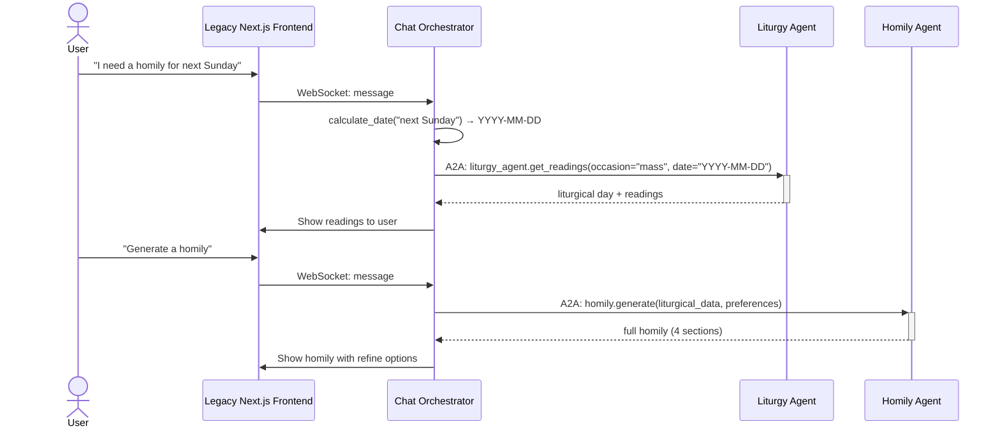
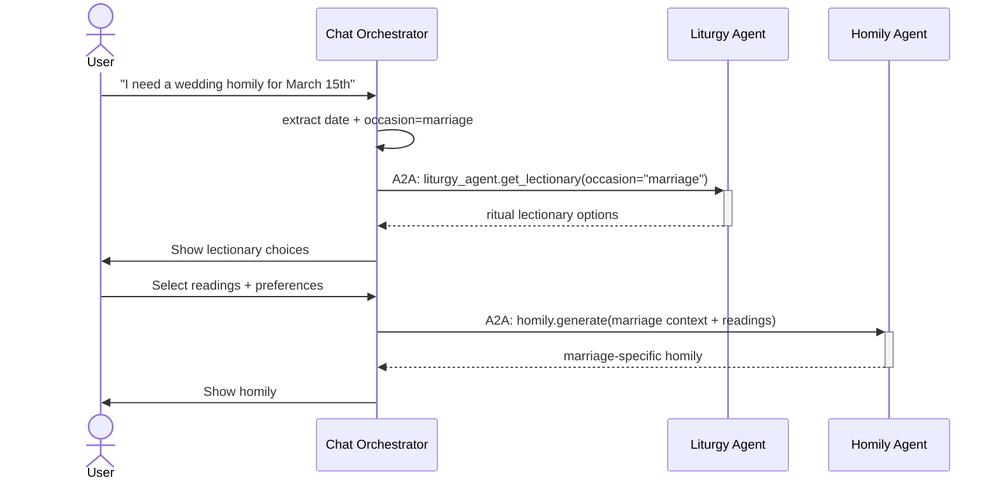

# Prete-a-porter — Architecture Guide

> Canonical reference for the multi-agent system. All agent descriptions, protocols,
> data models, and workflows live here. Other documentation files reference this
> document rather than duplicating its content.

**Quick links:**
- [Full code review report](docs/code-review-report.html) (39 issues, May 2026)
- [Configuration template](.env.example)
- [Docker deployment](docker-compose.yml)

---

## 1. System Overview

**Prete-a-porter** is an AI-powered system that assists Catholic priests and deacons
in preparing liturgically accurate and pastorally effective homilies. It uses
autonomous agents that communicate via a standardized Agent-to-Agent (A2A) protocol
over HTTP JSON-RPC 2.0.

```
┌──────────────────────────────────────────────────────────────┐
│                     CLIENT SHELLS (replaceable)               │
│   LibreChat (v0.8.7)  │  OpenWebUI (v0.11.4)  │  Next.js 14  │
│   deploy/librechat/   │  docker-compose       │  transitional│
└──────┬────────────────┬────────────────┬────────────────────┘
       │                │                │
       │ OpenAI-compatible HTTP          │ WebSocket (JWT)
       │ POST /v1/chat/completions       │ /ws/chat/{session_id}
       │ Bearer ORCHESTRATOR_API_KEY     │
       ↓                ↓                ↓
┌──────────────────────────────────────────────────────────────┐
│                  CHAT ORCHESTRATOR AGENT                      │
│        Conversation management, workflow coordination         │
│        FastAPI + LangGraph + WebSocket                        │
│        packages/chat-orchestrator/src/chat_orchestrator/      │
└──────────┬──────────────────────────────────┬────────────────┘
           │ A2A Protocol                     │ A2A Protocol
           │ (JSON-RPC 2.0 over HTTP)         │ (JSON-RPC 2.0 over HTTP)
           ↓                                  ↓
┌──────────────────────────┐  ┌──────────────────────────────┐
│    LITURGY AGENT         │  │  HOMILY GENERATION AGENT      │
│  Liturgical data retrieval│  │  Homily content generation   │
│  LangGraph + LLM         │  │  LangGraph + RAG + ChromaDB  │
│  packages/liturgy-agent/ │  │  packages/homily-agent/       │
│  SQLite cache            │  │  sentence-transformers        │
└──────────────────────────┘  └──────────────────────────────┘
```

Chat shells own generic chat-product concerns (accounts, conversation
persistence, history, rendering). Prête-à-Porter owns the agent runtime
(orchestration, tools, A2A, RAG). The `/v1/*` HTTP surface is the boundary
between them; see the client-boundary spec in `AgentWorklog` for the contract.

**Native UI path (2026-09-18).** `packages/prete-chat` (Chainlit 2.12.0) runs
beside the shells and **imports `chat_orchestrator.application` in-process** — it
never speaks the OpenAI API. It calls the agents over the same A2A protocol and
keeps its own users and conversation history in its own PostgreSQL database
(`deploy/chainlit/`, ADR-009).

### Quality Goals

| Priority | Goal | Target | Verification |
|----------|------|--------|-------------|
| 1 | Correctness | Liturgical data matches the Roman Rite calendar | Integration tests per agent |
| 2 | Response time | Homily generation < 30s (90th percentile) | E2E performance tests |
| 3 | Event-loop safety | No blocking calls in async paths | mypy + code review |
| 4 | Provider independence | All 3 LLM providers work without code changes | CI with ANTHROPIC/GOOGLE/OPENAI keys |

### Technology Stack

| Layer | Technology | Location | Source Files |
|-------|-----------|----------|-------------|
| Frontend | Next.js 14 (App Router), React 18, TypeScript, Tailwind CSS | `frontend/` | 20+ TSX files |
| Chat Orchestrator | FastAPI, LangGraph | `packages/chat-orchestrator/` | 11 Python + 2 utils |
| Chat Shells | LibreChat v0.8.7 (`deploy/librechat/`), OpenWebUI v0.11.4, Next.js 14 (transitional) | `deploy/`, `docker-compose.yml`, `frontend/` | — |
| Native UI | Chainlit 2.12.0 + SQLAlchemy/PostgreSQL data layer | `packages/prete-chat/` | 12 Python |
| Liturgy Agent | LangGraph, BeautifulSoup, SQLite | `packages/liturgy-agent/` | 7 Python + 3 JSON lectionaries |
| Homily Agent | LangGraph, ChromaDB, sentence-transformers | `packages/homily-agent/` | 7 Python + 4 RAG |
| A2A Protocol | JSON-RPC 2.0, HTTP/SSE | `packages/a2a-protocol/` | 6 Python |
| **Total** | | | **56 Python + 3 JSON** (source files, tests excluded) |

---

## 2. Architecture Constraints

| Constraint | Motivation | Impact |
|-----------|-----------|--------|
| Python 3.12+ | Async/await, pattern matching, type hints | No Python 3.9 support |
| LangGraph 0.2+ | State machine orchestration | Agents depend on StateGraph, checkpointer |
| ChromaDB + sentence-transformers | Local RAG without cloud dependency | No Pinecone/OpenAI embeddings in production |
| PostgreSQL (frontend) + SQLite (agents) | Prisma ORM + local agent caching | Schema must be relational for frontend |
| HTTP-only transport | Microservices deployment | No stdio/gRPC transport implemented |
| Basic Auth for A2A | Inter-agent security | Credentials shared via A2A_BASIC_AUTH env vars |
| Client shells are replaceable | Avoid UI lock-in and duplicated product work | OpenAI-compatible shells consume `/v1/*`; the native Chainlit adapter is the intentional exception and imports the transport-independent application seam in-process |

---

## 3. Agent-to-Agent (A2A) Protocol

The protocol is implemented in `packages/a2a-protocol/src/a2a_protocol/` and follows
the JSON-RPC 2.0 specification over HTTP transport.

### Agent Card

Each agent exposes an Agent Card describing its capabilities (following Google A2A
spec conventions):

| Field | Description |
|-------|-------------|
| `name` | Agent service name (e.g., `liturgy_agent`) |
| `description` | Purpose of the agent |
| `capabilities.streaming` | Whether SSE streaming is supported |
| `skills` | List of supported A2A methods |

### Message Format

```json
// Request
{
  "jsonrpc": "2.0",
  "id": "uuid",
  "method": "agent.method_name",
  "params": { ... }
}

// Success Response
{
  "jsonrpc": "2.0",
  "id": "uuid",
  "result": { ... }
}

// Error Response
{
  "jsonrpc": "2.0",
  "id": "uuid",
  "error": {
    "code": -32603,
    "message": "Internal error",
    "data": { ... }
  }
}
```

### Error Codes

| Code | Name | Description |
|------|------|-------------|
| -32700 | Parse Error | Invalid JSON |
| -32600 | Invalid Request | Malformed request object |
| -32601 | Method Not Found | Unknown method |
| -32602 | Invalid Params | Invalid method parameters |
| -32603 | Internal Error | Server-side error |
| -32000 | Agent Not Found | Target agent unavailable |
| -32001 | Agent Timeout | Agent did not respond in time |
| -32002 | Agent Busy | Agent is processing another request |
| -32003 | Transport Error | Communication failure |
| -32004 | Rate Limit Exceeded | Too many requests |

### Transport

| Transport | Implementation | Use Case |
|-----------|---------------|----------|
| **HTTP** | `httpx.AsyncClient` POST to `{agent_url}/` | Production: microservices, retry with backoff |
| **SSE** | `httpx.AsyncClient` streaming to `{agent_url}/stream` | Production: real-time streaming responses |

Only HTTP transport is implemented. Stdio transport was removed in favor of
HTTP-only microservices deployment (see ADR-002).

### Capabilities

| From | To | Methods |
|------|----|---------|
| Chat Orchestrator | Liturgy Agent | `liturgy_agent.get_readings`, `liturgy_agent.get_lectionary`, `agent.ping` |
| Chat Orchestrator | Homily Agent | `homily.generate`, `homily.refine`, `homily.adjust_tone`, `agent.ping` |

### Security

All A2A HTTP requests carry HTTP Basic Auth headers (`A2A_BASIC_AUTH_USERNAME` /
`A2A_BASIC_AUTH_PASSWORD`). The `/health` endpoint bypasses auth. The A2A server
validates credentials via `_basic_auth_middleware` in `server.py:401`.

---

## 4. Chat Orchestrator Agent

**Location**: `packages/chat-orchestrator/src/chat_orchestrator/`

### Role
Manages user conversations via WebSocket, coordinates specialized agents via the
A2A protocol, and guides the homily preparation workflow.

### Technology
- **Runtime**: Python 3.12+, async/await
- **Framework**: FastAPI + LangGraph
- **LLM**: Dynamic (Anthropic / Google / OpenAI — see `create_llm()`)
- **State**: stateless per request — the caller owns conversation history; no checkpointer
- **Pattern**: ReAct (Reasoning + Acting)

### API Endpoints

| Method | Path | Auth | Description |
|--------|------|------|-------------|
| `GET` | `/health` | none | Health check |
| `GET` | `/v1/models` | Bearer | Advertises the model `prete-a-porter` (OpenAI-compatible clients) |
| `POST` | `/v1/chat/completions` | Bearer | Chat completion, buffered or SSE |
| `WS` | `/ws/chat/{session_id}` | JWT `ws_ticket` | Real-time chat (transitional; the Next.js frontend still uses it) |

The `/v1/*` surface is **stateless**: every request carries its full message
history, and no checkpointer exists. `ORCHESTRATOR_API_KEY` is the bearer key and
must not be named `OPENAI_API_KEY`, which is the upstream provider key. Callers
are LibreChat, OpenWebUI, or any OpenAI-compatible SDK.

Per-user identity and the rate-limit key come from headers the client forwards:

| Header | Client | Used for |
|--------|--------|----------|
| `X-OpenWebUI-User-Id` / `X-User-ID` | OpenWebUI / LibreChat | Rate-limit key |
| `X-OpenWebUI-Chat-Id` / `X-Conversation-ID` | OpenWebUI / LibreChat | Thread correlation |
| `X-OpenWebUI-User-Email` / `X-User-Email` | either | Log correlation |
| `X-Message-ID` | LibreChat | Trace correlation |

The namespaced OpenWebUI names win when both families are present; missing values
degrade with a one-time warning (`anonymous` user, fresh thread id).
`CHAT_REQUEST_TIMEOUT_SECONDS` bounds every `/v1` request: buffered requests
return `504` on expiry, streams emit an in-band `timeout` error before `[DONE]`.

The `/ws/*` path and the Next.js frontend remain until the OpenWebUI cutover is
verified end to end; see `AgentWorklog` migration plan P6. The WebSocket message
loop is **not** bounded by `CHAT_REQUEST_TIMEOUT_SECONDS`.

### Architecture

```
Client shells (LibreChat / OpenWebUI / Next.js)
    │
    ├── POST /v1/chat/completions  (api/v1.py → api/messages.py)
    │        ↓
    └── WS /ws/chat/{session_id}   (routes.py)
             ↓
LangGraph (agent_node → tools_node → should_continue)
    ↓
A2A Client → liturgy-agent (HTTP) or homily-agent (HTTP)
    ↓
Response → OpenAI-shaped payload/SSE or WebSocket frame
```

Transport-independent by construction: both transports invoke the same compiled
graph, which holds no server-side conversation state.

### Tools

| Tool | File | Description |
|------|------|-------------|
| `get_current_date` | `tools.py:30` | Returns today's date |
| `calculate_date` | `tools.py:52` | Resolves natural language dates (e.g., "next Sunday") |
| `get_liturgical_readings` | `tools.py:146` | Fetches readings from Liturgy Agent via A2A |
| `get_liturgical_lectionary` | `tools.py:162` | Retrieves lectionary choices for special occasions |
| `request_homily_generation` | `tools.py:362` | Generates homily via Homily Agent A2A |
| `request_homily_refinement` | `tools.py:380` | Refines existing homily via Homily Agent A2A |

### Known Issues

- The WebSocket message loop has no timeout on `graph.ainvoke()` — a stuck agent
  invocation hangs the socket permanently. The `/v1/*` path is bounded by
  `CHAT_REQUEST_TIMEOUT_SECONDS` (2026-09-18); the legacy loop is not, and retires
  with the frontend.

---

## 5. Liturgy Agent

**Location**: `packages/liturgy-agent/src/liturgy_agent/`

### Role
Autonomous liturgical data retrieval and validation specialist. Handles date
resolution, web scraping with caching, and ritual-specific lectionary data.

### Technology
- **Runtime**: Python 3.12+, async/await
- **Framework**: LangGraph (StateGraph)
- **LLM**: Dynamic via `create_llm()`
- **Scraping**: BeautifulSoup4 + lxml + httpx
- **Cache**: SQLite with configurable TTL (default 24h)
- **Protocol**: A2A (JSON-RPC 2.0 over HTTP)

### Modules

| Module | Path | Purpose |
|--------|------|---------|
| `state.py` | `liturgy_agent/state.py` | Pydantic models: `LiturgyAgentState`, `LiturgicalReading`, `Reading`, `LiturgicalMetadata` |
| `cache.py` | `liturgy_agent/cache.py` | SQLite caching with TTL expiration |
| `scrapers.py` | `liturgy_agent/scrapers.py` | `EvangelizeScraper` + `fetch_liturgical_data()` — Evangelizo.org API |
| `agent.py` | `liturgy_agent/agent.py` | `LiturgyAgent` — core logic with tools |
| `graph.py` | `liturgy_agent/graph.py` | `create_liturgy_agent_graph()` — LangGraph state machine |
| `main.py` | `liturgy_agent/main.py` | A2A server entry point |

### Workflow

```
Incoming A2A Request (get_readings / get_lectionary)
    ↓
Parse Request (validate date + occasion)
    ↓
Data Retrieval (cache → evangelizo.org → lectionary JSON)
    ↓
Format Response (A2A JSON-RPC 2.0)
```

### Data Sources

| Source | Type | Content |
|--------|------|---------|
| SQLite Cache | Local database | Cached readings with configurable TTL |
| `evangelizo.org` | Web scraping | Daily Gospel readings, liturgical calendar |
| Lectionary JSON | `lectionaries/*.json` | Pre-loaded ritual readings (marriage, baptism, funeral) |

### Architecture Decisions

| ID | Decision | Rationale |
|----|----------|-----------|
| ADR-003 | SQLite over Redis | No distributed caching needed; single-instance agents |
| ADR-004 | Evangelizo only scraper | Vatican scraper was dead code (always returned same page); removed 2026-05-19 |

---

## 6. Homily Generation Agent

**Location**: `packages/homily-agent/src/homily_agent/`

### Role
Generates, refines, and validates homily content using Retrieval-Augmented
Generation (RAG) against a theological knowledge base. Supports occasion-specific
content, style adaptation, and iterative refinement.

### Technology
- **Runtime**: Python 3.12+
- **Framework**: LangGraph (StateGraph)
- **LLM**: Dynamic via `create_llm()`
- **Vector DB**: ChromaDB (local only)
- **Embeddings**: sentence-transformers (`all-MiniLM-L6-v2`)
- **Protocol**: A2A (JSON-RPC 2.0 over HTTP)

### Modules

| Module | Path | Purpose |
|--------|------|---------|
| `state.py` | `homily_agent/state.py` | Pydantic models: `HomilyAgentState`, `UserPreferences`, `GeneratedHomily`, `HomilySection` |
| `agent.py` | `homily_agent/agent.py` | `HomilyAgent` — core logic: parse, generate, refine, validate, format |
| `graph.py` | `homily_agent/graph.py` | `create_homily_graph()` — LangGraph state machine |
| `generator.py` | `homily_agent/generator.py` | `HomilyGenerator` — section-based generation engine |
| `main.py` | `homily_agent/main.py` | A2A server entry point |
| `rag/embeddings.py` | `homily_agent/rag/embeddings.py` | `EmbeddingService` — sentence-transformers wrapper |
| `rag/retrieval.py` | `homily_agent/rag/retrieval.py` | ChromaDB vector search, configurable top-k/min-similarity |
| `rag/bible_parser.py` | `homily_agent/rag/bible_parser.py` | `BibleParser` — HTML Bible verse parser |
| `rag/catechism_parser.py` | `homily_agent/rag/catechism_parser.py` | `CatechismParser` — PDF parser for Catechism |

### Workflow

```
Incoming A2A Request (generate / refine / adjust_tone)
    ↓
Parse Request (extract preferences, set defaults)
    ↓
RAG Retrieval (query theological knowledge base via ChromaDB)
    ↓
Outline Generation (intro → reflection → application → conclusion)
    ↓
Section Generation (4 sections with occasion-specific templates)
    ↓
Theological Validation (verify accuracy and appropriateness)
    ↓
Format Response (A2A JSON-RPC 2.0)
```

### RAG Pipeline

```
Query (occasion + themes)
    ↓
Embedding (sentence-transformers / all-MiniLM-L6-v2)
    ↓
Vector Search (ChromaDB, top-k = RAG_TOP_K, min similarity = RAG_MIN_SIMILARITY)
    ↓
Retrieved Documents (theological sources)
    ↓
Context Assembly (for LLM prompt)
```

### User Preferences

| Parameter | Options | Default |
|-----------|---------|---------|
| `target_audience` | `adults`, `youth`, `children`, `mixed` | `adults` |
| `tone` | `formal`, `conversational`, `poetic`, `consolatory`, `celebratory` | `formal` |
| `length` | `short` (5-7 min), `medium` (10-12 min), `long` (15+ min) | `medium` |
| `themes` | Array of theme strings | `None` |
| `metaphors` | Array of metaphor strings | `None` |
| `analogies` | Array of analogy strings | `None` |
| `parables` | Array of parable strings | `None` |

### Architecture Decisions

| ID | Decision | Rationale |
|----|----------|-----------|
| ADR-005 | ChromaDB over Pinecone | Zero cloud dependency; single-instance agents; Pinecone not implemented |
| ADR-006 | sentence-transformers over OpenAI embeddings | Local execution, no API costs, consistent with ChromaDB local-only design |
| ADR-007 | Lazy initialization of RAG services | Avoid heavy ChromaDB + sentence-transformers load at import time; init on first request |

---

## 7. Data Models

### Agent States

Each agent has a LangGraph `State` model:

| Agent | State Class | File |
|-------|------------|------|
| Chat Orchestrator | `ChatState` (extends `MessagesState`) | `chat-orchestrator/state.py` |
| Liturgy Agent | `LiturgyAgentState` | `liturgy-agent/state.py:74` |
| Homily Agent | `HomilyAgentState` | `homily-agent/state.py:106` |

### LiturgicalDay

> This type is composed from `LiturgicalReading` + `LiturgicalMetadata` in both
> `liturgy-agent/state.py` and `homily-agent/state.py`. Both modules define
> identical models — this is a known duplication.

```python
class LiturgicalReading:
    date: str                          # ISO 8601 (YYYY-MM-DD)
    occasion: Literal["mass", "marriage", "baptism", "funeral"]
    metadata: LiturgicalMetadata       # season, color, year_cycle, sunday_or_weekday
    first_reading: Reading
    psalm: Reading
    second_reading: Optional[Reading]
    gospel: Reading
    alleluia_verse: Optional[Reading]  # liturgy-agent only
    cached_at: datetime                # liturgy-agent only
    source: str                        # "evangelizo.org", "lectionary", etc.
```

### Reading

```python
class Reading:
    reference: str                     # e.g. "Gn 1:1-5" (liturgy agent) or "Gen 1:1-5" (homily agent)
    text: str                          # Full text
    type: Literal["First", "Second", "Gospel", "Psalm", "Alleluia"]
```

> **Note:** Bible abbreviation conventions differ across agents. Liturgy agent uses
> `"Gn"` for Genesis (`agent.py:259`), homily agent uses `"Gen"` (`bible_parser.py:34`).
> This is a known inconsistency (see Known Issues).

### GeneratedHomily

```python
class GeneratedHomily:
    introduction: HomilySection
    reading_reflection: HomilySection
    practical_application: HomilySection
    conclusion: HomilySection
    occasion: Literal["mass", "marriage", "baptism", "funeral"]
    liturgical_date: str
```

---

## 8. Workflows (Runtime View)

### 8.1 Homily Preparation (Primary Flow)

> Sequence below shows the legacy Next.js / WebSocket path. OpenWebUI and
> LibreChat reach the same orchestrator tools via `/v1`; Chainlit uses the
> in-process application seam.


```mermaid
sequenceDiagram
    actor User
    participant UI as Legacy Next.js Frontend
    participant WS as Chat Orchestrator
    participant LA as Liturgy Agent
    participant HA as Homily Agent

    User->>UI: "I need a homily for next Sunday"
    UI->>WS: WebSocket: message
    WS->>WS: calculate_date("next Sunday") → YYYY-MM-DD
    WS->>+LA: A2A: liturgy_agent.get_readings(occasion="mass", date="YYYY-MM-DD")
    LA-->>-WS: liturgical day + readings
    WS->>UI: Show readings to user
    User->>UI: "Generate a homily"
    UI->>WS: WebSocket: message
    WS->>+HA: A2A: homily.generate(liturgical_data, preferences)
    HA-->>-WS: full homily (4 sections)
    WS->>UI: Show homily with refine options
```

### 8.2 Occasion-Specific Homily (Marriage, Baptism, Funeral)


```mermaid
sequenceDiagram
    actor User
    participant WS as Chat Orchestrator
    participant LA as Liturgy Agent
    participant HA as Homily Agent

    User->>WS: "I need a wedding homily for March 15th"
    WS->>WS: extract date + occasion=marriage
    WS->>+LA: A2A: liturgy_agent.get_lectionary(occasion="marriage")
    LA-->>-WS: ritual lectionary options
    WS->>User: Show lectionary choices
    User->>WS: Select readings + preferences
    WS->>+HA: A2A: homily.generate(marriage context + readings)
    HA-->>-WS: marriage-specific homily
    WS->>User: Show homily
```

### 8.3 Date Validation

```
User: "Is February 30th valid?"
  → WS: get_current_date + calculate_date → "February 30th doesn't exist"
  → Immediate response (no A2A needed)
```

---

## 9. Configuration

All agents are configured via environment variables. See `.env.example` for a
complete template.

### LLM Provider Selection

Defined in `packages/a2a-protocol/src/a2a_protocol/llm.py`. The factory selects
the **first available API key** in priority order:

```
ANTHROPIC_API_KEY → GOOGLE_API_KEY → OPENAI_API_KEY
```

Only one provider is active per session.

| To use | Set | Leave empty |
|--------|-----|-------------|
| **Claude (Anthropic)** | `ANTHROPIC_API_KEY` | `GOOGLE_API_KEY`, `OPENAI_API_KEY` |
| **Gemini (Google)** | `GOOGLE_API_KEY` | `ANTHROPIC_API_KEY`, `OPENAI_API_KEY` |
| **OpenAI / compatible** | `OPENAI_API_KEY` | `ANTHROPIC_API_KEY`, `GOOGLE_API_KEY` |

OpenAI-compatible providers (Fireworks, Groq, Together, Ollama, vLLM) all use
`ChatOpenAI` with `OPENAI_BASE_URL`:

| Provider | `OPENAI_BASE_URL` | `OPENAI_MODEL_NAME` |
|----------|-------------------|---------------------|
| OpenAI | `https://api.openai.com/v1` | `gpt-4-turbo-preview` |
| Fireworks AI | `https://api.fireworks.ai/inference/v1` | `accounts/fireworks/models/llama-v3p1-70b-instruct` |
| Groq | `https://api.groq.com/openai/v1` | `llama-3.3-70b-versatile` |
| Ollama (local) | `http://localhost:11434/v1` | `llama3.2` |

### LLM Environment Variables

| Variable | Default | Description |
|----------|---------|-------------|
| `ANTHROPIC_API_KEY` | — | API key for Claude |
| `ANTHROPIC_MODEL_NAME` | `claude-3-5-sonnet-20241022` | Anthropic model name |
| `ANTHROPIC_BASE_URL` | `https://api.anthropic.com` | Anthropic endpoint (for proxies/emulators) |
| `GOOGLE_API_KEY` | — | API key for Gemini |
| `GOOGLE_MODEL_NAME` | `gemini-flash-lite-latest` | Google model name |
| `OPENAI_API_KEY` | — | API key for OpenAI and compatible providers |
| `OPENAI_MODEL_NAME` | `gpt-4-turbo-preview` | OpenAI/compatible model name |
| `OPENAI_BASE_URL` | `https://api.openai.com/v1` | OpenAI/compatible endpoint |

### Shared (all services)

| Variable | Default | Description |
|----------|---------|-------------|
| `LOG_LEVEL` | `INFO` | Logging level (DEBUG, INFO, WARNING, ERROR) |
| `LOG_JSON_FORMAT` | `false` | Structured JSON logging |
| `A2A_BASIC_AUTH_USERNAME` | — | HTTP Basic Auth for A2A communication |
| `A2A_BASIC_AUTH_PASSWORD` | — | HTTP Basic Auth password |

### Chat Orchestrator

| Variable | Default | Description |
|----------|---------|-------------|
| `ORCHESTRATOR_API_KEY` | — | Bearer key for `/v1/*`. Must not be named `OPENAI_API_KEY`, which is the upstream provider key |
| `WS_JWT_SECRET` | — | JWT secret for WebSocket auth (transitional) |
| `CORS_ORIGINS` | `http://localhost:3000` | Allowed CORS origins (comma-separated) |
| `A2A_LITURGY_URL` | `http://localhost:8001` | Liturgy agent HTTP URL |
| `A2A_HOMILY_URL` | `http://localhost:8002` | Homily agent HTTP URL |
| `RATE_LIMIT_MESSAGES_PER_HOUR` | `5` | Per-identity hourly message quota |
| `RATE_LIMIT_MESSAGES_PER_DAY` | `20` | Per-identity daily message quota |
| `CHAT_REQUEST_TIMEOUT_SECONDS` | `180` | Wall-clock bound for one `/v1` request (buffered, streamed, utility) |

### OpenWebUI

| Variable | Default | Description |
|----------|---------|-------------|
| `WEBUI_SECRET_KEY` | — | OpenWebUI session signing |
| `OPENAI_API_BASE_URL` | `http://chat-orchestrator:8000/v1` | Where OpenWebUI sends chat requests |
| `OPENAI_API_KEY` | `${ORCHESTRATOR_API_KEY}` | OpenWebUI's name for the bearer token it sends |
| `ENABLE_FORWARD_USER_INFO_HEADERS` | `True` | Sends `X-OpenWebUI-User-Id`, the per-user rate-limit key |

### LibreChat

Started only with the overlay:
`docker compose -f docker-compose.yml -f deploy/librechat/docker-compose.librechat.yml up -d`.
Both UIs run side by side; OpenWebUI is unaffected. Deployment details and the
pinned version live in [`deploy/librechat/README.md`](deploy/librechat/README.md).

| Variable | Default | Description |
|----------|---------|-------------|
| `LIBRECHAT_IMAGE_TAG` | `v0.8.7` | Pinned LibreChat release (latest stable as of 2026-09-18) |
| `PRETE_API_BASE_URL` | `http://chat-orchestrator:8000/v1` | API root LibreChat targets |
| `LIBRECHAT_JWT_SECRET` | — | Session tokens (`openssl rand -hex 32`) |
| `LIBRECHAT_JWT_REFRESH_SECRET` | — | Refresh tokens (`openssl rand -hex 32`) |
| `LIBRECHAT_CREDS_KEY` | — | Credential encryption key (`openssl rand -hex 32`) |
| `LIBRECHAT_CREDS_IV` | — | Credential encryption IV (`openssl rand -hex 16`) |
| `LIBRECHAT_DOMAIN_CLIENT` / `LIBRECHAT_DOMAIN_SERVER` | `http://localhost:3002` | Public URL LibreChat advertises |
| `LIBRECHAT_ALLOW_REGISTRATION` | `true` | Open registration; disable once pilot accounts exist |

`deploy/librechat/librechat.yaml` forwards `X-User-ID`, `X-Conversation-ID`,
`X-Message-ID` and `X-User-Email`, and disables LibreChat Memory, RAG, web
search, Agents/MCP, and title generation so the shell does not duplicate or
invoke the agent runtime.

### Liturgy Agent

| Variable | Default | Description |
|----------|---------|-------------|
| `DATABASE_PATH` | `/app/data/liturgy_cache.db` | Cache database (Docker path) |
| `EVANGELIZO_BASE_URL` | `https://evangelizo.org` | Primary scraper source |
| `CACHE_TTL_SECONDS` | `86400` | Cache freshness (24h) |
| `AGENT_CONTRACT_PATH` | — | Path to A2A contract JSON |
| `AGENT_URL` | — | Public URL for this agent |

### Homily Agent

| Variable | Default | Description |
|----------|---------|-------------|
| `EMBEDDING_MODEL` | `sentence-transformers/all-MiniLM-L6-v2` | Embedding model for RAG |
| `RAG_TOP_K` | `5` | Documents to retrieve per query |
| `RAG_MIN_SIMILARITY` | `0.7` | Minimum cosine similarity threshold |
| `AGENT_CONTRACT_PATH` | — | Path to A2A contract JSON |
| `AGENT_URL` | — | Public URL for this agent |

---

## 10. Testing

> **Verification levels:** [`docs/verification-levels.md`](docs/verification-levels.md)
> records how each module was actually tested — unit, container, integration with a
> stubbed model, and end-to-end against a real model — and which level caught which
> class of defect. [`docs/testing.rst`](docs/testing.rst) describes an intended
> strategy and names tooling that is not installed; prefer the former.

### Test Locations

| Location | Path | Files | Layer |
|----------|------|:-----:|-------|
| A2A Protocol | `packages/a2a-protocol/tests/` | 4 | Unit |
| Chat Orchestrator | `packages/chat-orchestrator/tests/` | 19 | Unit |
| Liturgy Agent | `packages/liturgy-agent/tests/` | 4 | Unit |
| Homily Agent | `packages/homily-agent/tests/` | 1 | Unit |
| prete-chat (native UI) | `packages/prete-chat/tests/` | 8 | Unit |
| Contracts | `contracts/tests/` | 7 | Static + Live + E2E |
| **Total** | | **43 test files** | |

### Running Tests

```bash
# --- Package unit tests ---
cd packages/a2a-protocol && uv run pytest -v
cd packages/liturgy-agent && uv run python -m pytest -v
cd packages/homily-agent && uv run python -m pytest -v
cd packages/chat-orchestrator && uv run pytest -v
cd packages/prete-chat && uv run pytest -v

# --- Contract tests (static definition, no agents needed) ---
cd contracts && uv run pytest tests/test_liturgy_contract.py::TestContractCompliance \
               tests/test_homily_contract.py::TestHomilyContractDefinition -v

# --- Contract tests (full suite via Docker Compose) ---
cd contracts && uv run pytest tests/ -v

# --- Contract tests (services already running) ---
cd contracts && uv run pytest tests/ -v --no-docker

# --- With coverage ---
cd packages/liturgy-agent && uv run python -m pytest --cov=src/liturgy_agent tests/

# --- Specific module ---
cd packages/a2a-protocol && uv run pytest tests/test_transport_routes.py -v
```

> **Note:** Contract live/E2E tests require running agents. Start them via
> `docker compose up -d --build liturgy-agent homily-agent chat-orchestrator`
> or let `conftest.py` manage Docker Compose automatically. See
> [`contracts/README.md`](contracts/README.md) for env requirements.

### Test Categories

| Type | Scope | Location | Notes |
|------|-------|----------|-------|
| Unit | Individual modules, isolated | `packages/*/tests/` | Fast, no external dependencies, uses mocks |
| Contract definition | Static JSON contract validation | `contracts/tests/test_*_contract.py` | No agents needed; validates fields, methods, error codes |
| Live agent | A2A message/send against running agent | `contracts/tests/test_*_contract.py` | Requires agents on ports 8001/8002; skips if unreachable |
| E2E | Full user → chat → agent flows | `contracts/tests/test_*_e2e.py` | Requires Docker Compose or `--no-docker` with running services |

### CI

Contract tests run on push/PR to `main` via
[`.github/workflows/contract-tests.yml`](.github/workflows/contract-tests.yml).
See [`contracts/README.md`](contracts/README.md) for full details.

---

## 11. Known Issues & Technical Risks

The following are significant issues identified during code review. Issues marked
**Resolved** have been fixed in the codebase but are listed here for historical
reference.

| ID | Severity | Issue | File | Status |
|----|----------|-------|------|--------|
| 1 | Critical | `backend/` path references → `packages/` — 17+ files pointed to non-existent directory | Multiple | **Partially Resolved** (2026-05-19): 4 Sphinx toctree entries remain (`:doc:\`backend/index\``) |
| 3 | Critical | A2A transport sent to `/a2a` but server listened on `/` — all HTTP A2A calls returned 404 | `transport.py:174` | **Resolved** (2026-05-19): URL changed to `/` |
| 4 | Critical | Blocking `graph.invoke()` inside async method blocked event loop | `homily-agent/main.py:124` | **Resolved** (2026-05-19): changed to `await graph.ainvoke()` |
| 5 | Critical | `_validate_node` called `validate_homily()` but discarded return value | `homily-agent/graph.py:117-122` | **Resolved** (2026-05-19): result now assigned and set on state |
| 6 | Important | Cache permanently disabled (`if False and cached`) | `liturgy-agent/cache.py` | **Resolved** (2026-05-19): guard removed, cache functional |
| 7 | Important | Vatican scraper fetched static URL regardless of date | `liturgy-agent/scrapers.py` | **Resolved** (2026-05-19): dead code removed |
| 9 | Important | Bible abbreviations inconsistent: liturgy uses `"Gn"`, homily uses `"Gen"` | `agent.py:259` vs `bible-parser.py:34` | Active |
| 10 | Cleanup | `langchain-fireworks` removed — Fireworks now uses `ChatOpenAI` | `llm.py` | **Resolved** (2026-05-26) |
| 11 | Important | `_format_node` calls `format_response()` but discards return value | `homily-agent/graph.py:128-133` | Active — same pattern as #5 |
| 12 | Important | `_chunk_text` never terminates if `overlap >= chunk_size` | `homily-agent/rag/retrieval.py:258` | Active |
| 13 | Important | `LiturgicalReading(**data)` raises unhandled Pydantic `ValidationError` on bad scraped data | `liturgy-agent/agent.py:487` | Active |
| 14 | Minor | `datetime.utcnow()` deprecated in Python 3.12 | `liturgy-agent/cache.py:94` | Active |
| 15 | Important | Homily generation/refinement fails when the model retypes the readings payload with `occasion: "sunday"`: `LiturgicalReading.occasion` only accepts `mass|marriage|baptism|funeral`, and the tool error is handed back to the LLM as text (observed twice in the Chainlit walkthrough, codes `5865a0d1`/`ee41a6a9`/`ca35fde1`) | `homily-agent/main.py:112` | Active |

### Technical Risks

| Risk | Impact | Mitigation |
|------|--------|------------|
| LLM provider API outage | All agents stop responding | Graceful degradation: cached readings still served, homily generation fails |
| ChromaDB corruption | RAG returns empty results | `reset_collection()` method available; periodic re-indexing |
| WebSocket connection leak | Orphaned connections consume resources | Heartbeat mechanism not yet implemented (see code review report) |
| Graph execution timeout | Request hangs indefinitely | `/v1` requests are bounded by `CHAT_REQUEST_TIMEOUT_SECONDS` (504 or in-band timeout error); the transitional WebSocket loop remains unbounded |

### Non-Architectural Issues

Issues affecting frontend, Docker, E2E, or infrastructure are tracked in the
[full code review report](docs/code-review-report.html). Key items:

| Area | Issue |
|------|-------|
| Frontend | No server-side password validation on registration |
| Frontend | No WebSocket heartbeat/ping mechanism |
| Frontend | `prose-liturgy` Tailwind class does nothing |
| Docker | Hardcoded filesystem path in `contracts/pyproject.toml` |
| E2E | 401 Unauthorized (Basic Auth credentials not sent by test helpers) |
| E2E | Docker health check timeout (120s insufficient) |

---

## 12. Architecture Decision Log

This log records significant architectural decisions, their rationale, and
trade-offs.

| ID | Date | Decision | Rationale | Trade-offs |
|----|------|----------|-----------|------------|
| ADR-001 | 2026-05-19 | A2A over MCP for inter-agent communication | MCP is tool-focused (model-to-tool); A2A is agent-to-agent with task lifecycle | A2A less mature ecosystem; no stdlib in Python |
| ADR-002 | 2026-05-19 | HTTP-only transport (remove stdio) | Microservices deployment; stdio added complexity for no benefit in containerized env | Loses ability to run agents as subprocesses for debugging |
| ADR-003 | 2026-05-19 | SQLite for agent caching | Single-instance agents; no distributed cache needed | Not suitable for multi-replica scaling |
| ADR-004 | 2026-05-19 | Evangelizo as sole scraper source | Vatican scraper was dead code (always returned same static page) | Single source of truth; no fallback if Evangelizo is down |
| ADR-005 | 2026-05-19 | ChromaDB as vector store (no Pinecone) | Zero cloud dependency; local-only deployment; Pinecone code never written | Not horizontally scalable; no managed backup |
| ADR-006 | 2026-05-19 | sentence-transformers for embeddings | Local execution, no API costs, deterministic | Limited to smaller models; no access to OpenAI-quality embeddings |
| ADR-007 | 2026-05-26 | Lazy init RAG in homily agent | ChromaDB + sentence-transformers are heavy (200ms+ startup) | First request is slower; error surfaces at runtime not at import |
| ADR-008 | 2026-09-18 | Multiple chat shells over one OpenAI-compatible boundary (LibreChat + OpenWebUI + transitional WebSocket) | Shells own generic chat-product concerns; Prête keeps the agent runtime; each shell is independently replaceable | Two UIs to operate; the boundary contract must stay client-neutral; shell-specific auxiliary requests (titles, tags) must be disabled client-side |
| ADR-009 | 2026-09-18 | Native UI: Chainlit 2.12.0 as a separate service (`packages/prete-chat`) importing the `chat_orchestrator.application` seam in-process, with its own PostgreSQL for users and conversation history | Keeps the OpenAI API as the interoperability boundary; the core never imports Chainlit and stays stateless; the native UI sees LangGraph tool events directly; a UI failure cannot take down `/v1`; dependency drift stays in the app's own lock | One more service and database to operate; the seam (`application.py`) is now the shared execution path and must stay behaviour-neutral for `/v1` |

---

## 13. Code Review Cross-Reference

The full code review report is at `docs/code-review-report.html` (39 issues,
May 2026). It covers:

- **14 frontend issues**: React, WebSocket, Next.js, auth, CSS
- **16 backend agent issues**: A2A Protocol, Liturgy, Homily, Chat Orchestrator
- **8 infrastructure issues**: Docker, CI/CD, docs, config
- **5 contract/data issues**: Schema mismatch, dead paths, validation

Issues #1–#14 in §11 of this document are a subset of the review findings,
filtered to **architectural and backend issues only**. The full report contains
the complete list with detailed reproduction steps and fix recommendations.

---

## 14. Native UI — prete-chat (Chainlit)

**Location**: `packages/prete-chat/` · **Port**: `127.0.0.1:3003` (container 8000)
· **Overlay**: `deploy/chainlit/docker-compose.chainlit.yml`

A separate service that imports `chat_orchestrator.application` **in-process**. It
never calls `/v1/*` and needs no `ORCHESTRATOR_API_KEY`; the core never imports
Chainlit. Failures are isolated: a UI crash cannot take down the API.

| Module | Purpose |
|---|---|
| `app.py` | Chainlit entry point: lifecycle hooks (start/resume/message/settings/stop/logout), starters, quota, one boundary log line per turn |
| `runner.py` | The only core import surface (`application.stream_chat`, rate limiter) — the test seam |
| `history.py` | Model-visible history: in-session accumulation and `ThreadDict` reconstruction (user/assistant text only) |
| `auth.py` | Password auth: bcrypt hash (cost 10) in the Chainlit user metadata |
| `data_layer.py` | `SerializedSQLAlchemyDataLayer`: the bundled layer with statements serialized |
| `preferences.py` / `actions.py` | Italian controls mapped to `ChatPreferences`; refinement actions composed into user turns |
| `errors.py` / `labels.py` | Italian status text; tool-step titles |
| `scripts/create_user.py` | Operator provisioning (no stock signup) |

**Persistence**: its own PostgreSQL (`prete-chat-db`, `postgres:17.6-alpine`;
schema `deploy/chainlit/init.sql`) holding users, threads, steps, elements and
feedbacks. Conversation history is canonical there; the core stores nothing.
Deploy, upgrade and backup procedures live in `deploy/chainlit/README.md`.

**Configuration**: `DATABASE_URL` (`postgresql+asyncpg://…` enables persistence
**and** login; anything else keeps POC mode), `CHAINLIT_AUTH_SECRET`,
`CHAINLIT_URL`, `PRETE_CHAT_DB_PASSWORD`, `RATE_LIMIT_DB_PATH` (its own SQLite),
plus the shared LLM/A2A/timeout/quota variables. Chainlit is pinned exactly.

**Rollback**: stop the overlay (`docker compose … down prete-chat prete-chat-db`);
the base stack is untouched. Unsetting `DATABASE_URL` runs the service without
persistence and without login.

**Rules**: do not route OpenAI clients through Chainlit, and never import
Chainlit from the core — `application.py` is the shared execution path. Open
owner decisions (plan §29): provisioning for existing users, hostname/cutover
versus OpenWebUI, retention, and acceptance of the preference controls.

---

## Document History

| Date | Change |
|------|--------|
| 2026-05-19 | Created — consolidated from SPECIFICATION.md, SPECIFICATION_PLAN.md, and package docs |
| 2026-05-26 | Rewritten for accuracy: corrected config defaults, resolved issue statuses, removed Pinecone/stdio references, added arc42-style sections (constraints, ADRs, quality goals), linked code review report |
| 2026-09-18 | Client boundary: LibreChat added as a second shell (`deploy/librechat/`) alongside OpenWebUI; `/v1` identity headers and timeout documented; ADR-008 added; stale checkpointer references removed |
| 2026-09-18 | Native UI: Chainlit service (`packages/prete-chat`) with its own PostgreSQL, password auth, Italian UX, preferences and refinement actions; `application` seam extracted in chat-orchestrator; ADR-009; known issue #15 added; `prete-chat` added to both CI matrices |
