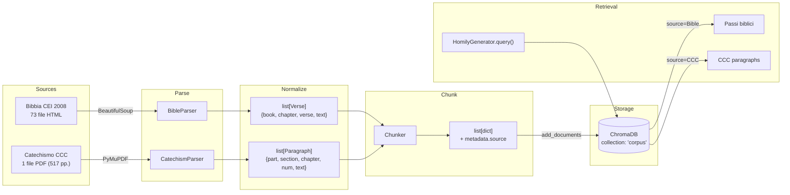
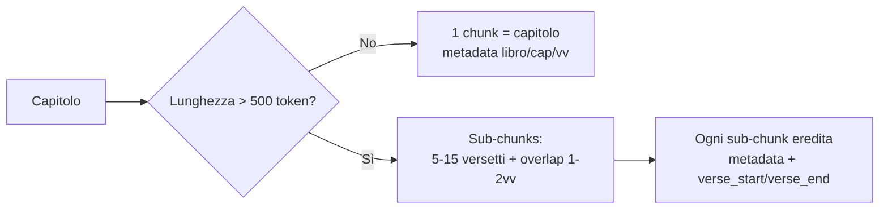
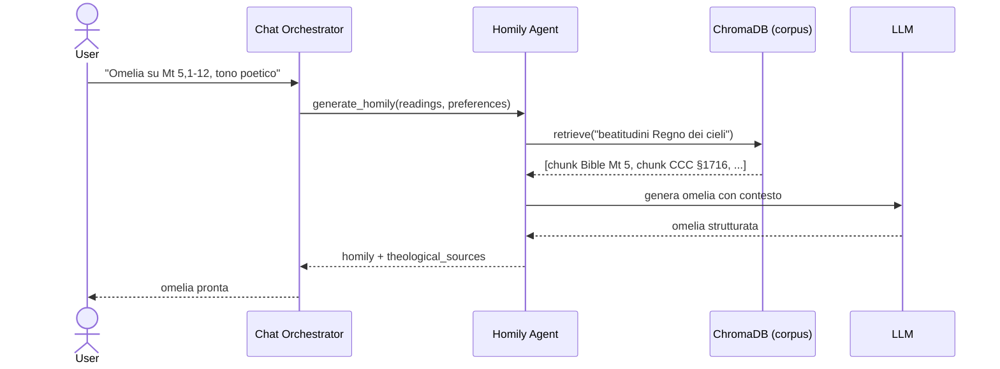

# Bible Knowledge Base — Design Doc

## Overview

Popolare ChromaDB con una knowledge base teologica strutturata (Bibbia CEI 2008 + Catechismo della Chiesa Cattolica) per arricchire il retrieval semantico dell'homily-agent. Una singola collezione `"corpus"` contiene chunks con metadata `source` che differenzia la provenienza.

## Architecture



## Sources

### Bibbia CEI 2008

**Path:** `support/bibbia2008/bcei2008/`

**Formato:** 73 file HTML (1 per libro), HTML 4.01 Transitional, charset us-ascii.

**Struttura HTML:**
- `<h1>` → titolo libro (es. "GENESI")
- `<h2>` con anchor `#cap_libro_N` → inizio capitolo
- `<sup><b>N</b></sup>` dentro `<p>` → numero versetto
- Versetti multipli per `<p>`, separati da `<br>`

**Chunking:**

| Condizione | Strategia |
|---|---|
| Capitolo ≤ ~500 token | 1 chunk = capitolo intero |
| Capitolo > ~500 token | Sub-chunks di 5-15 versetti + overlap 1-2 versetti |

**Metadata:**
```python
{
  "source": "Bible",
  "book": "Genesi",
  "abbreviation": "Gen",
  "chapter": 1,
  "verse_start": 1,
  "verse_end": 31,
  "testament": "AT",
  "section": "Pentateuco",
  "book_type": "narrative"
}
```

**Abbreviazioni (cei):**
Gen, Es, Lv, Nm, Dt, Gs, Gdc, Rt, 1Sam, 2Sam, 1Re, 2Re, 1Cr, 2Cr, Esd, Ne, Tb, Gdt, Est, 1Mac, 2Mac, Gb, Sal, Pr, Qo, Ct, Sap, Sir, Is, Ger, Lam, Bar, Ez, Dn, Os, Gl, Am, Abd, Gn, Mi, Na, Ab, Sof, Ag, Zc, Ml, Mt, Mc, Lc, Gv, At, Rm, 1Cor, 2Cor, Gal, Ef, Fil, Col, 1Ts, 2Ts, 1Tm, 2Tm, Tt, Fm, Eb, Gc, 1Pt, 2Pt, 1Gv, 2Gv, 3Gv, Gd, Ap

**Book types:** `narrative`, `poetry`, `law`, `prophecy`, `letter`, `gospel`

**Decision tree chunking:**



### Catechismo della Chiesa Cattolica

**Path:** `support/catechismo/catechismo-della-chiesa-cattolica.pdf`

**Formato:** PDF, 517 pagine, struttura gerarchica regolare.

**Struttura:**
```
PARTE x - Titolo
  SEZIONE x - Titolo
    CAPITOLO x - Titolo
      I. Sottosezione ...
        N. Paragrafo numerato (1-2865)
```

**Chunking:**

| Unità | Strategia |
|---|---|
| Paragrafi numerati (1-2865) | 1 paragrafo = 1 chunk (già brevi, 100-400 char) |
| Paragrafi adiacenti sotto stesso sottotitolo | Gruppo 2-5 paragrafi se semanticamente uniti |

**Metadata:**
```python
{
  "source": "CCC",
  "part": 1,
  "part_title": "La professione della fede",
  "section": 1,
  "section_title": "Io credo - Noi crediamo",
  "chapter": 1,
  "chapter_title": "L'uomo è capace di Dio",
  "subsection": "I",
  "subsection_title": "La vita dell'uomo - conoscere e amare Dio",
  "paragraph_num": 27,
  "paragraph_title": "Il desiderio di Dio"
}
```

## Modules

### `src/homily_agent/rag/bible_parser.py`

```python
class BibleParser:
    def __init__(self, html_dir: str)
    def parse_all(self) -> list[Verse]
    def parse_file(self, path: Path) -> list[Verse]

class Chunker:
    def chunk(self, verses: list[Verse]) -> list[BibleChunk]
    def _chunk_by_chapter(self, verses: list[Verse]) -> list[BibleChunk]

@dataclass Verse:
    book, abbreviation, chapter, verse, text, testament, section, book_type

@dataclass BibleChunk:
    id, text, metadata: dict
```

### `src/homily_agent/rag/catechism_parser.py`

```python
class CatechismParser:
    def __init__(self, pdf_path: str)
    def parse(self) -> list[Paragraph]
    def _extract_structure(self, text: str) -> list[Paragraph]

@dataclass Paragraph:
    part, part_title, section, section_title, chapter, chapter_title,
    subsection, subsection_title, paragraph_num, paragraph_title, text
```

### `src/homily_agent/rag/base.py`

Dataclass condivisi e interfacce comuni per i parser.

### `scripts/ingest_corpus.py`

CLI orchestratore:

```
python scripts/ingest_corpus.py [--reset] [--bible-dir PATH] [--ccc-path PATH]
```

Passaggi:
1. `BibleParser(support/bibbia2008/bcei2008).parse_all()`
2. `CatechismParser(support/catechismo/ccc.pdf).parse()`
3. `Chunker` su entrambi
4. `RetrievalService(collection_name="corpus").add_documents(chunks)`
5. Report finale (libri, capitoli, paragrafi, chunks)

## Integration with HomilyGenerator

Modifiche minime:
- `HomilyGenerator.__init__` passa `collection_name="corpus"` al `RetrievalService`
- Nessun cambio alla logica di `_build_theme_query` o `_retrieve_theological_content`

## Sequence Diagram



## Testing

- **BibleParser**: test con file HTML reale di un libro (es. Abdia, 1 capitolo) e uno multi-capitolo (es. Genesi, 50 capitoli)
- **CatechismParser**: test parse di un gruppo di pagine CCC, verifica estrazione gerarchia e numeri paragrafo
- **Chunker**: test soglia 500 token, overlap, metadata corretti
- **Integration**: ingestion completa + query di retrieval reale su ChromaDB

## Feature branch

`feature/bible-knowledge-base`
